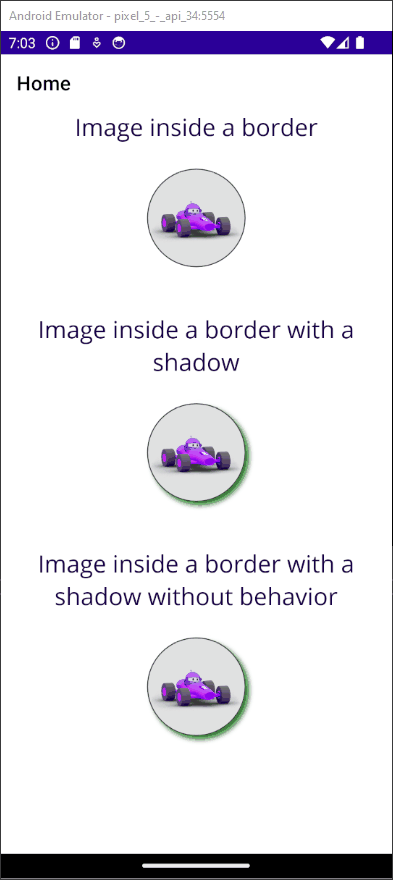

# BugMauiShadowTouch

This repository demonstrates a weird beahvior in MAUI (or the CommunityToolkit) when running in Android (14).
When running in Windows, everything is working as it should.

1. An `Image` without a `Border` and a `TapGestureRecognizer` and a `TouchBehavior`
> The Toast is shown when clicked

2. An `Image` with a `Border` and a `Shadow` and a `TapGestureRecognizer` and a `TouchBehavior`
> The Toast is **not** shown when clicked

3. An `Image` with a `Border` and a `Shadow` and a `TapGestureRecognizer` (**without** a `TouchBehavior`)
> The Toast is shown when clicked

**Tested MAUI version: 8.0.82 and CommunityToolkit.Maui 9.0.3**

*The repro is based on the default template for a MAUI app.*

